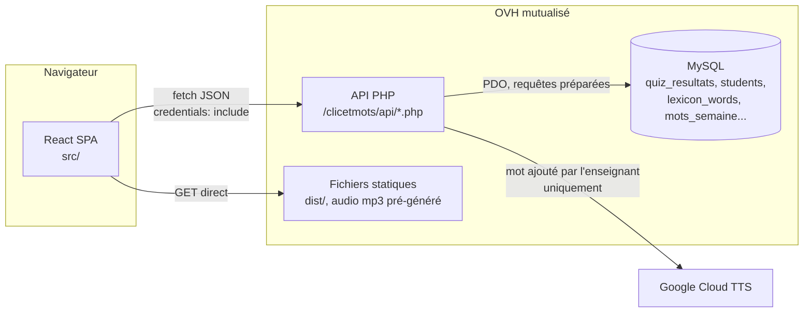

# Backend "espace enseignant" (PHP + MySQL, OVH)

API pour l'authentification (élèves + enseignant), la gestion des comptes
élèves, l'ajout de mots au lexique, les listes de mots de la semaine, et le
suivi pédagogique (résultats de quiz, bilans, mots ratés en dictée) —
hébergée à côté du site statique, dans `/clicetmots/api/` sur le même
hébergement OVH. Nécessite PHP 8.x (`password_hash`) et une base MySQL.

## Architecture

Le frontend est une SPA statique : aucune donnée n'est rendue côté serveur.
Le backend PHP n'est appelé que pour ce qui nécessite un état côté serveur
(comptes, scores, listes) — tout le lexique, l'audio pré-généré et les
pictogrammes sont servis comme de simples fichiers statiques, sans aucun
aller-retour PHP/MySQL au moment de la consultation.

## Installation (à faire toi-même, une seule fois)

1. **Base de données** : dans le manager OVH, section "Bases de données",
   crée une base (ou utilise-en une existante). Note l'hôte, le nom, le
   user et le mot de passe.
2. **Tables** : ouvre phpMyAdmin/Adminer depuis le manager OVH sur cette
   base, et exécute **dans cet ordre** le contenu de chaque fichier (colle-le
   dans l'onglet SQL, "Exécuter") :

   | Fichier | Ce qu'il ajoute |
   |---|---|
   | [`schema.sql`](./schema.sql) | tables de base : comptes enseignant/élèves, mots ajoutés, anti brute-force |
   | [`schema-v2.sql`](./schema-v2.sql) | conjugaison générée + relations saisies à la main |
   | [`schema-v3.sql`](./schema-v3.sql) | forme féminine d'un adjectif ajouté |
   | [`schema-v4.sql`](./schema-v4.sql) | listes de mots de la semaine |
   | [`schema-v5.sql`](./schema-v5.sql) | recherche directe par orthographe, autorisée par élève |
   | [`schema-v6.sql`](./schema-v6.sql) | scores de quiz, favoris et historique centralisés par élève |
   | [`schema-v7.sql`](./schema-v7.sql) | mode confort de lecture (dys), activé par élève |
   | [`schema-v8.sql`](./schema-v8.sql) | dictée des mots de la semaine (nouveau mode + filet de secours par élève) |
   | [`schema-v9.sql`](./schema-v9.sql) | atelier "choisis la bonne graphie" (nouveau mode) |
   | [`schema-v10.sql`](./schema-v10.sql) | mots ratés en dictée, retenus d'une semaine à l'autre |
   | [`schema-v11.sql`](./schema-v11.sql) | réponses réussies du premier coup, distinguées de celles réussies après plusieurs essais |
   | [`schema-v12.sql`](./schema-v12.sql) | usage du filet de secours de la dictée ("Je ne sais pas l'écrire") |
   | [`schema-v13.sql`](./schema-v13.sql) | durée d'une séance de quiz (bilan enseignant uniquement) |
   | [`schema-v14.sql`](./schema-v14.sql) | 3 catégories de réussite en dictée : premier coup, reprise de fin de séance, avec aide |

   Il n'y a pas de fichier "tout-en-un" : ces migrations sont la seule
   source de vérité du schéma, et en dupliquer le contenu ailleurs
   finirait par diverger. Une installation neuve les passe donc toutes,
   une installation existante ne passe que les nouvelles.

   Les `CREATE TABLE` sont sans risque si relancés (`IF NOT EXISTS`), mais
   les `ALTER TABLE ... ADD COLUMN` des migrations v2 et suivantes ne
   peuvent l'être qu'une fois : relancer une migration déjà passée affiche
   une erreur "Duplicate column name" sur cette ligne précise, sans gravité
   (voir l'en-tête de chaque fichier).
3. **Config** : copie `api/config.php.example` en `api/config.php`, remplis
   `DB_HOST`/`DB_NAME`/`DB_USER`/`DB_PASS` avec les infos de l'étape 1, et
   choisis un `SETUP_TOKEN` — une longue chaîne aléatoire à toi (par
   exemple générée avec `openssl rand -hex 32` dans un terminal, ou avec ton
   gestionnaire de mots de passe). Ce fichier ne doit **jamais** être commité
   dans Git (déjà dans `.gitignore`).

   Optionnel : `GOOGLE_TTS_API_KEY` génère automatiquement la prononciation
   d'un mot ajouté par l'enseignant (Google Cloud Console -> "API et
   services" -> "Identifiants" -> "Créer des identifiants" -> "Clé API",
   puis restreins-la à l'API "Cloud Text-to-Speech" uniquement). Laissée
   vide, l'ajout de mot fonctionne quand même — seule la prononciation
   retombe sur la synthèse vocale du navigateur (voir `api/tts.php`).
4. **Upload FTP** : envoie tout le dossier `server/` sur OVH, dans
   `/clicetmots/api-src/` par exemple, PUIS place le contenu du sous-dossier
   `api/` dans `/clicetmots/api/` (à la racine de `/clicetmots/`, à côté du site
   déployé) — c'est ce chemin `/clicetmots/api/...` que le frontend appelle.
   `setup.html` peut rester où tu veux (ex. directement dans `/clicetmots/`),
   tu n'en as besoin qu'une fois.
5. **Créer le compte enseignant** : ouvre `setup.html` dans ton navigateur
   (ex. `https://www.cours-vandewalle.fr/clicetmots/setup.html`), remplis le
   jeton (celui mis dans `config.php`), un identifiant et un mot de passe
   pour ta compagne. Une fois le compte créé, **supprime** `setup.html` et
   `api/setup.php` du serveur (sécurité : empêche quiconque de retenter la
   création d'un compte, même si ça échouerait de toute façon tant qu'un
   compte enseignant existe déjà).

## Sécurité

- Mots de passe jamais stockés en clair (`password_hash`/`password_verify`).
- Sessions HttpOnly + Secure + SameSite=Lax, avec régénération de
  l'identifiant de session à chaque connexion réussie (contre la fixation
  de session).
- Un compte élève supprimé voit sa session invalidée immédiatement, sans
  attendre l'expiration du cookie (vérification dans `requireAuth`).
- Anti brute-force basique : 10 tentatives / 15 min par IP (voir `auth.php`).
  À surveiller en usage scolaire : tous les postes d'une école sortent
  souvent avec la même IP publique, donc plusieurs élèves qui se trompent
  peuvent atteindre le seuil collectivement.
- Réponses API en `Cache-Control: no-store` : aucune n'a vocation à être
  mise en cache par le navigateur.
- Toutes les requêtes SQL intégrant des entrées utilisateur utilisent des
  requêtes préparées PDO afin de prévenir les injections SQL.
- Le lexique ajouté manuellement valide la catégorie et chaque touche
  phonétique contre une liste fermée côté serveur — impossible d'y glisser
  autre chose que des données conformes au format attendu par le site.

## Endpoints

| Méthode | Chemin | Accès | Description |
|---|---|---|---|
| POST | `/api/login.php` | public | `{identifiant, motDePasse}` → session |
| POST | `/api/logout.php` | connecté | détruit la session |
| GET | `/api/session.php` | public | état de connexion actuel |
| GET | `/api/students.php` | enseignant | liste des élèves, avec leurs réglages |
| POST | `/api/students.php` | enseignant | `{prenom, motDePasse}` → crée un élève |
| PATCH | `/api/students.php?id=` | enseignant | `{rechercheDirecte?, confortLecture?}` → réglages d'un élève |
| DELETE | `/api/students.php?id=` | enseignant | supprime un élève (et toutes ses données) |
| GET | `/api/lexicon.php` | connecté | mots ajoutés, avec conjugaison et relations |
| POST | `/api/lexicon.php` | enseignant | `{mot, categorie, genre?, phonemes}` |
| DELETE | `/api/lexicon.php?id=` | enseignant | supprime un mot ajouté (et ses relations) |
| POST | `/api/relations.php` | enseignant | `{wordId, type, targetLemmaId, targetWord, targetCategory}` |
| DELETE | `/api/relations.php?wordId=&type=&targetLemmaId=` | enseignant | retire une relation |
| GET | `/api/mots-semaine.php` | connecté | toutes les listes hebdomadaires |
| POST | `/api/mots-semaine.php` | enseignant | `{nom, mots, id?}` → crée ou modifie une liste |
| DELETE | `/api/mots-semaine.php?id=` | enseignant | supprime une liste |
| GET | `/api/quiz-resultats.php` | élève | ses 500 derniers résultats de quiz (fenêtre large pour permettre un bilan par période sur une année complète) |
| POST | `/api/quiz-resultats.php` | élève | `{mode, score, total, premierCoup?, aideUtilisee?, dureeSecondes?, rattrapageReussi?, aideReussi?}` → enregistre une partie (les champs optionnels sont nullables, absents sur les séances d'avant leur migration respective) |
| DELETE | `/api/quiz-resultats.php` | élève | efface ses résultats |
| GET | `/api/dictee-rates.php` | élève | ses mots ratés en dictée, les plus ratés d'abord |
| POST | `/api/dictee-rates.php` | élève | `{lemmaId, word, reussi}` → incrémente le compteur, ou retire le mot si réussi |
| GET | `/api/bilan-eleve.php?studentId=` | enseignant | résultats (mêmes champs que `quiz-resultats.php`, 500 derniers) et mots les plus ratés en dictée d'un élève |
| GET | `/api/favoris.php` | élève | ses mots favoris |
| POST | `/api/favoris.php` | élève | `{lemmaId, word, category}` → ajoute un favori |
| DELETE | `/api/favoris.php?lemmaId=` | élève | retire un favori |
| GET | `/api/historique.php` | élève | ses 30 derniers mots consultés |
| POST | `/api/historique.php` | élève | `{lemmaId, word, category}` → enregistre une consultation |
| DELETE | `/api/historique.php` | élève | efface son historique |
| POST | `/api/reset-donnees.php` | enseignant | `{studentId?}` → efface quiz/favoris/historique d'un élève, ou de toute la classe |
| POST | `/api/tts.php` | enseignant | génère la prononciation d'un mot ajouté (Google TTS) |

Les données d'élève (quiz, favoris, historique, mots ratés en dictée) sont
purgées automatiquement au changement d'année scolaire, à la connexion de
l'élève (`purgerSiNouvelleAnneeScolaire` dans `auth.php`), et manuellement via
`reset-donnees.php`. Supprimer un compte élève efface aussi ses données
(`ON DELETE CASCADE`) et invalide immédiatement sa session ouverte.

## Conjugaison des verbes ajoutés

`api/conjugaison.php` génère le tableau (4 temps × 9 personnes) à l'ajout
d'un verbe, et le stocke en base. C'est un port de la logique de
`scripts/build-conjugation-index.mjs` : mêmes règles, mêmes exclusions —
les deux sorties ont été comparées verbe à verbe (1571 identiques sur 1572
comparables) et doivent le rester si l'une des deux évolue.

Un verbe dont la conjugaison n'est pas déterministe (irrégulier, -yer,
-eler/-eter) ne reçoit **aucun** tableau, volontairement : mieux vaut pas
de conjugaison qu'une orthographe inventée montrée à un enfant.

## Relations (synonymes / contraires / famille)

Elles ne sont pas déductibles pour un mot ajouté : Démonette et JeuxDeMots
ne le connaissent pas, et ces bases (~400 Mo) ne sont pas embarquées — elles
ne servent qu'au build. L'enseignant les saisit donc à la main, en piochant
dans le lexique existant. Elles sont symétriques : déclarer "wapiti"
synonyme de "cerf" fait aussi apparaître "wapiti" sur la fiche de "cerf".
